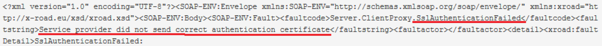
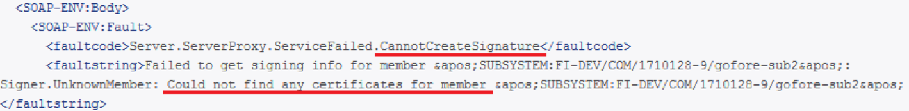

layout: true
name: sininen-palkki
class: sininen-palkki

---
layout: true
name: valkoinen
class: valkoinen

---
layout: true
name: header
class: center, middle, sininen

<!--DON'T TOUCH ABOVE THIS !!!!!! -->
---

template: header
# PIN-koodi

---

template: sininen-palkki
class: split-55

# PIN-koodin rajoitukset

.column[
- Suojaa hallintakäyttöliittymään konfiguroituja avaimia
- Liityntäpalvelimen asentajan päättämä koodi, jonka pituus on vähintään 10 merkkiä.
- PIN-koodissa pitää olla merkkejä vähintään kolmesta luokasta:
   - pienet kirjaimet,
   - isot kirjaimet,
   - numerot,
   - erikoismerkit.
- PIN-koodi täytyy säilyttää turvallisessa paikassa.
   - Palauttaminen ei ole mahdollista
]
.column[]

---

template: sininen-palkki

# PIN-koodin virheitä

- PIN-koodi syötettävä aina palvelimen uudelleenkäynnistyksen jälkeen uudelleen
- Sanomien lähettäminen epäonnistuu, jos koodin aktivointi on jäänyt tekemättä.
- Sanomat palauttavat faultcodea, joita voi tarkastella proxy-lokista
- Kutsujan liityntäpalvelimella PIN-koodi syöttämättä:

- Tarjoajan liityntäpalvelimella PIN-koodi syöttämättä:

---

template: sininen-palkki

# Automaattinen PIN-koodin syöttö

- Automaattinen PIN-koodin syöttäminen on mahdollista
   - Kehitystyössä käytössä ratkaisu, joka tallentaa koodin selväkielisenä palvelimelle
   - Automatisoitujen Ansible + SSH -skriptien käyttö myös mahdollista
   - Näiden tai oman ratkaisun käyttö tässä vaiheessa aina käyttäjän tietoinen valinta!
- Tätä varten tekeillä tuettu tietoturvallinen ratkaisu helpottamaan mm. kuormantasaajaliityntäpalvelimien ylläpitoa

---
template: header
# Kysymyksiä?
