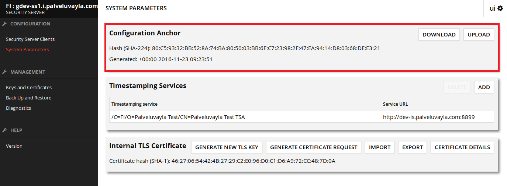
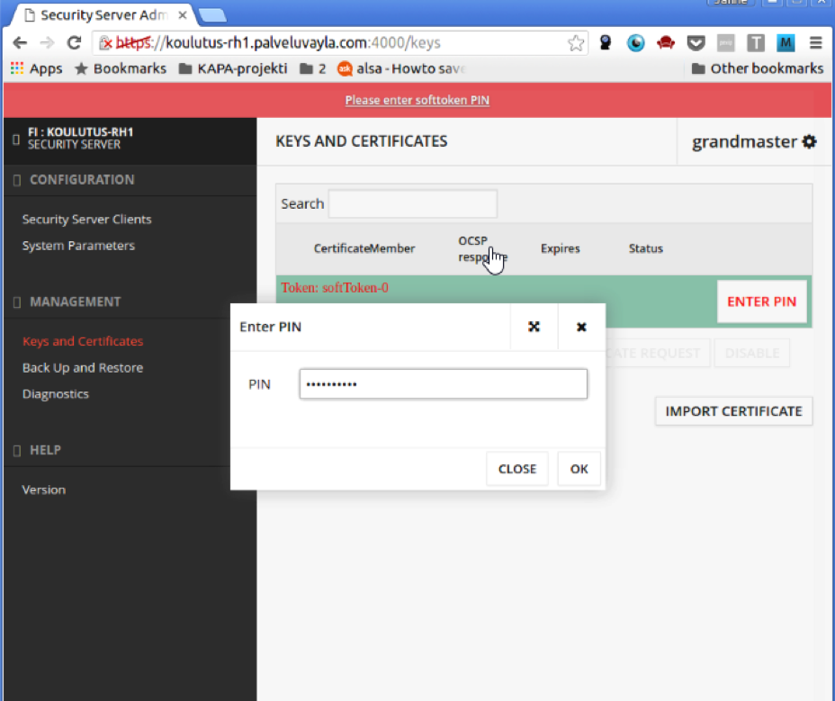
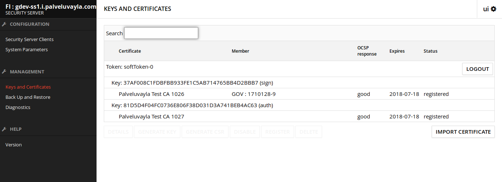
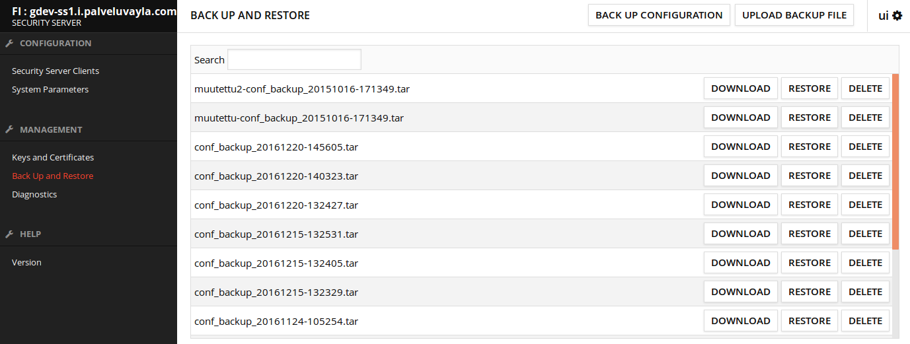
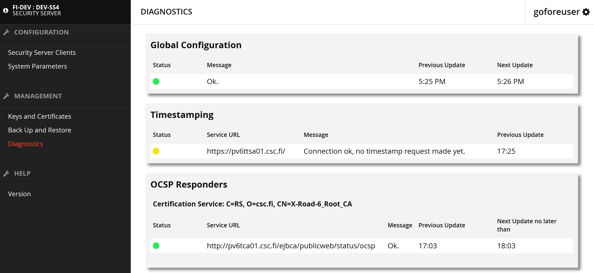
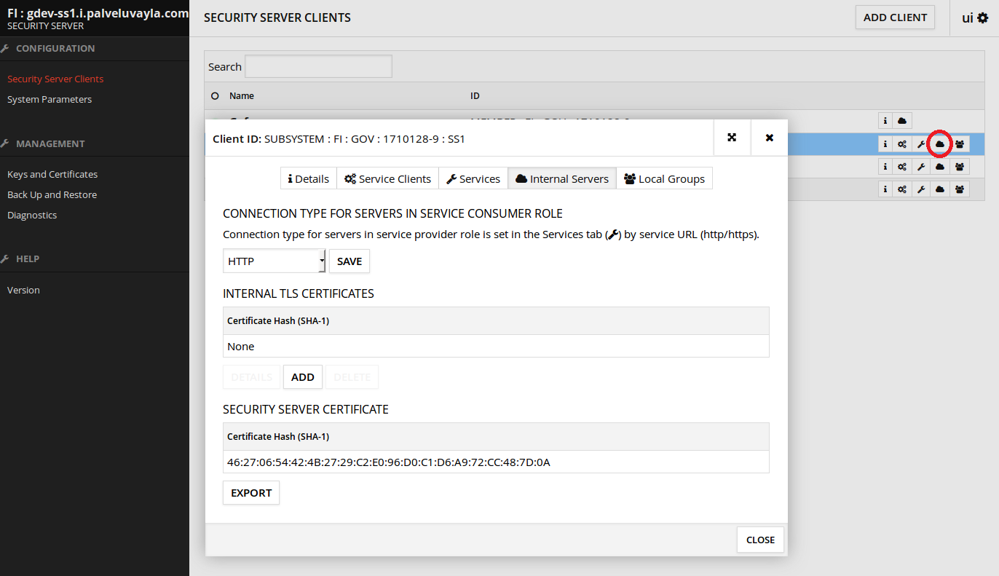

layout: true
name: sininen-palkki
class: sininen-palkki

---
layout: true
name: header
class: center, middle, sininen

---
layout: true
name: valkoinen
class: valkoinen

<!--DON'T TOUCH ABOVE THIS !!!!!! -->
---

template: header

# Liityntäpalvelimen admin-toimintoja

---
template: sininen-palkki

# Sisältö

* Konfiguraatioankkuri
* PIN-koodi syöttäminen
* Varmenteet
* Varmuuskopiointi ja palauttaminen
* Diagnostiikka
* TLS-yhteyksien hallinta

---
template: sininen-palkki

# Konfiguraatioankkuri

* XML-tiedosto, jonka palveluväylän ylläpitäjät toimittavat liittyjälle liityntäpalvelinasennuksen alussa
* Kytkee liityntäpalvelimen osaksi tiettyä palveluväyläympäristöä (FI-DEV, FI-TEST, FI)
* Konfiguraatioankkuri sisältää tiedon ympäristön keskuspalvelimen sijainnista ja varmenteesta.
    * Näillä tiedoilla liityntäpalvelin pystyy hakemaan kaikille yhteisen keskuskonfiguraation
ja saa tiedon siitä mitä muita liityntä- ja keskuspalvelimia on olemassa.

.center[]

---

template: sininen-palkki

# PIN-koodi

* PIN-koodia käytetään suojaamaan liityntäpalvelimelle tallennettuja avaimia
* Pidä PIN-koodisi tallessa! Tunnistevälineen (software token) tallentamien avainten tai
PIN-koodin palauttaminen ei ole mahdollista.
* Koodin syöttäminen vaaditaan aina palvelimen uudelleenkäynnistyksen jälkeen
    * Ilman PIN-koodin aktivointia sanomaliikenne ei ole mahdollista

.center[]

---

template: sininen-palkki

# Avaimet ja varmenteet

* Allekirjoitus- ja palvelinvarmenteiden hallinta
    * Varmenteiden allekirjoituspyyntöjen luonti
    * Allekirjoitettujen varmenteiden tuonti (import)

.center[]

---

template: sininen-palkki

# Varmuuskopiointi ja palauttaminen

* Tallentaa liityntäpalvelimen konfiguraation, sisältäen avaimet ja varmenteet

.center[]

---

template: sininen-palkki

# Diagnostiikka

* Diagnostics-välilehti kertoo nopeasti keskuskonfiguraation, aikaleimapalvelun ja OSCP-hakujen tilan katsomatta
tarkemmin liityntäpalvelimen lokitiedostoista

    * Punainen väri: Yhteyttä ei ole / haku epäonnistunut  
    * Keltainen väri: Yhteydenavausta tai hakua ei olla ehditty vielä tekemään
    * Vihreä: Yhteydet toimii / haut onnistuivat

.center[]

---

template: sininen-palkki

# Yhteyksien hallinta

* HTTPS-yhteyksien käyttöä varten käyttöliittymään voidaan lisätä luotettuja TLS-varmenteita
    * TLS:n käyttö määritellään WSDL-rajapinnan lisäämisen yhtedessä
* Security Server Certificate -kohdasta voidaan hakea liityntäpalvelimen oma palvelinvarmenne

.center[]

---

template: header

# Kiitos! Kysymyksiä?
