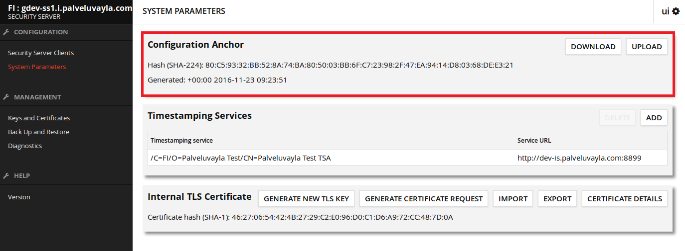
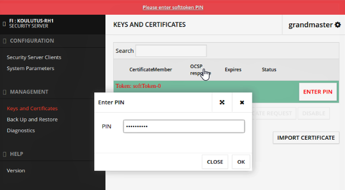
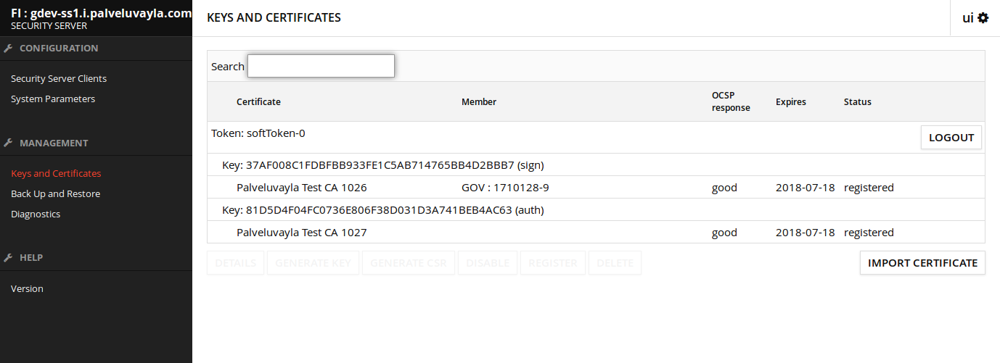
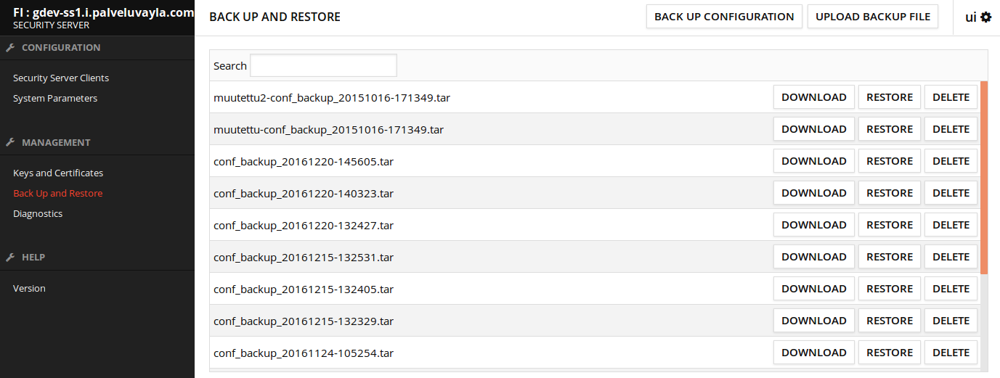

class: middle, center

# Liityntäpalvelimen admin-toimintoja

---

# Sisältö

* Konfiguraatioankkuri
* PIN-koodi syöttäminen
* Varmenteet
* Varmuuskopiointi ja palauttaminen
* Diagnostiikka
* TLS-yhteyksien hallinta
---

# Konfiguraatioankkuri 

* XML-tiedosto, jonka palveluväylän ylläpitäjät toimittavat liittyjälle liityntäpalvelinasennuksen alussa
* Kytkee liityntäpalvelimen osaksi tiettyä ympäristö palveluväyläympäristöä (FI-DEV, FI-TEST, FI)
* Konfiguraatioankkuri sisältää tiedon ympäristön keskuspalvelimen sijainnista ja varmenteesta.
    * Näillä tiedoilla liityntäpalvelin pystyy hakemaan kaikille yhteisen keskuskonfiguraation, 
ja saa tiedon siitä mitä muita liityntä- ja keskuspalvelimia on olemassa.

.center[]

---

# PIN-koodi

* PIN-koodia käytetään suojaamaan liityntäpalvelimelle tallennettuja avaimia
* Pidä PIN-koodisi tallessa! Tunnistevälineen (software token) tallentamien avainten tai 
PIN-koodin palauttaminen ei ole mahdollista. 
* Koodin syöttäminen vaaditaan aina palvelimen uudelleenkäynnistyksen jälkeen 
    * Ilman koodin aktivointia sanomaliikenne ei ole mahdollista
    
.center[]

---

# Avaimet ja varmenteet

* Allekirjoitus- ja autentikointivarmenteiden hallinta
    * Varmenteiden allekirjoituspyyntöjen luonti 
    * Allekirjoitettujen varmenteiden asettaminen (import)
    
.center[]

---

# Varmuuskopiointi ja palauttaminen

* Tallentaa liityntäpalvelimen konfiguraation, sisältäen avaimet ja varmenteet

.center[]

---

# Yhteyksien hallinta

* HTTPS yhteyksien käyttö varten käyttöliittymään voidaan lisätä luotettuja TLS-varmenteita
    * TLS:n käyttö määritellään WSDL-rajapinnan lisäämisen yhtedessä
* Security Server Certificate -kohdasta voidaan hakea liityntäpalvelimen oma palvelinvarmenne 

.center[]
