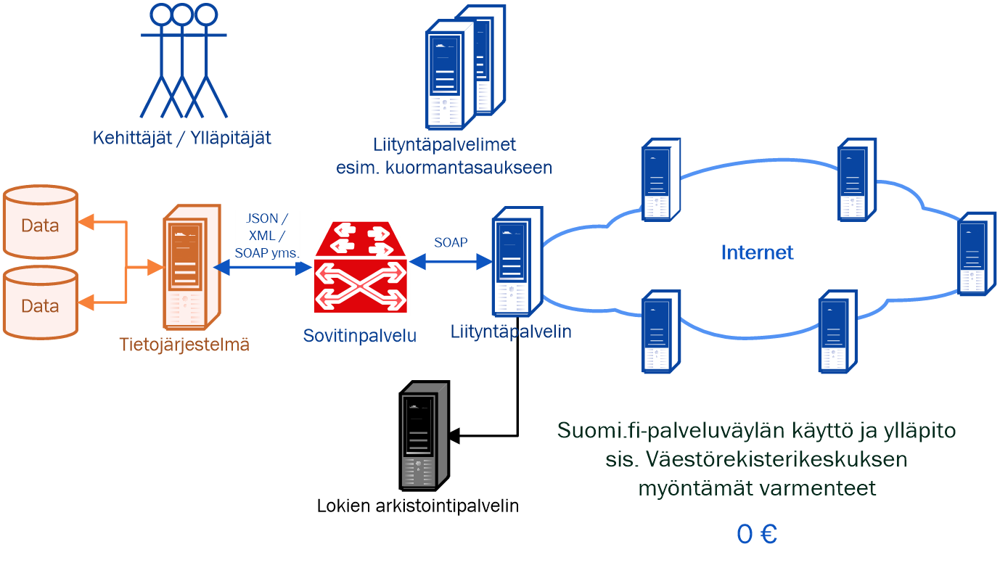

layout: true
name: sininen-palkki
class: sininen-palkki

---
layout: true
name: valkoinen
class: valkoinen

---
layout: true
name: header
class: center, middle, sininen

<!--DON'T TOUCH ABOVE THIS !!!!!! -->
---

template: header
# Suomi.fi-palveluväylän käyttöönotto

---

template: sininen-palkki

# Ennen liittymistä

- Perehdy runsaaseen aineistoon, mm. palvelukuvaukseen, käyttöehtoihin ja käyttöönoton ohjeisiin
    - https://esuomi.fi/palveluntarjoajille/palveluvayla/   
- Youtube-video liityntäpalvelimen asentamisesta ja konfiguroinnista
    - https://www.youtube.com/watch?v=jHlr0jiOhUE&list=PLfKPQ6CBHVsx-c8YPSqZhBka0vjv2YvEh	
- Lähdekoodit ja teknisempi dokumentaatio
    - https://github.com/ria-ee/X-Road
- Esimerkki siitä miten palveluväylän kautta hoidetut palvelukutsut toimivat
    - https://gofore.com/miten-viestit-liikkuvat-suomi-fi-palveluvaylassa/   

---

template: sininen-palkki
class: split-55

# Näin liityt

.column[
1. Lähetä rekisteröintipyyntö esuomi.fi-sivulta löytyvällä lomakkeella 
    - Liitä lomakkeen mukaan täytetyt autentikointi- ja allekirjoitusvarmennehakemukset
2. Saat kuittauksen palveluväylän ylläpidolta, jonka jälkeen voit aloittaa liityntäpalvelimen asennukset
3. Kun asennukset on tehtynä onnistuneesti voit lähteä testaamaan yhteyksien ja mahdollisia palveluja
4. Viimeinen vaihe tuotantoympäristöön liitymisen jälkeen on liityntäkatalogitietojen täyttäminen 
]
.column[]

---

template: sininen-palkki

# Liityntäkatalogi

- https://liityntakatalogi.suomi.fi/
- Hakemisto Suomi.fi-palveluväylän (FI-ympäristön) tarjottavista palveluista ja lista liittyneistä organisaatioista
- Tarkoituksena on helpottaa eri palveluntarjoajien palveluväyläympäristöön lisättyjen palveluiden löytämistä 
- Liittynyt organisaatio täyttää puuttuvat tiedot, kun palvelu on saatu tuotua tuotantoympäristöön.

---

template: sininen-palkki

# Liityntäkatalogi 

- https://liityntakatalogi.suomi.fi/ 
    - Hallinnolliset kuvaukset
    - Tekniset rajapintakuvaukset 

---

template: sininen-palkki

# Liittymisprosessi kuvana 

- https://esuomi.fi/palveluntarjoajille/palveluvayla/liittyminen/
- Tuotantoympäristöön liittyminen edellyttää testiympäristöön liittymistä 
- Oman järjestelmän integraatiotyön suunnittelu ja toteutus kannattaa myös aloittaa
- Liityntäpalvelimen asennukseen testi- tai tuotantoympäristöön voi kulua jopa kuukausi
    - Varmennepalvelun ruuhkat aiheuttavat viivettä 
- Kehitysympäristöön liittyminen suhteessa kevyempää, sillä sinne ei tarvita varmennehakemuksia
    - Hyvä vaihtoehto, jos ei esimerkiksi tuotantoon siirtyminen ole näkypiirissä

---

template: sininen-palkki

# Mikä maksaa käyttöönotossa?

---
template: sininen-palkki

# Yhteystiedot

- kapa-asiakaspalvelu@vrk.fi 
    - Auttaa yleisissä hallinnollisissa asioissa
      - Auttaa etsimään vastaavat henkilöt mistä tahansa Suomi.fi-palvelusta
    - esim. KaPa-lain velvoittavuuskysymykset
    
- palveluvayla@palveluvayla.fi 
    - Palveluväyläympäristöjen ylläpitäjät
    - Yhteyspiste liityntäpalvelin asennuksen ja konfiguroinnin aikana 
        - Yhteydenpitoa tarvitaan mm. rekisteröintien ja varmennekäsittelyjen aikana 
        
---
template: header

# Kysymyksiä?
