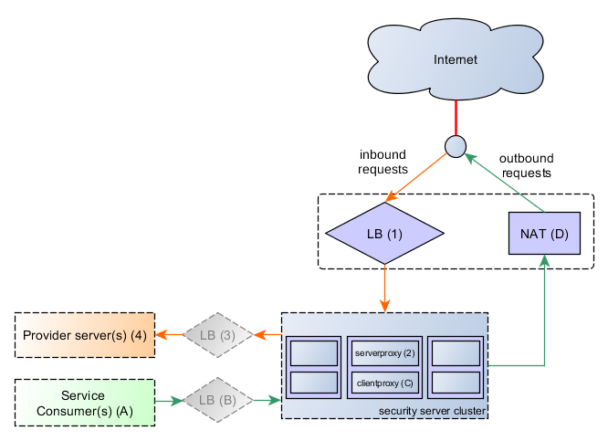

---

# Kuormantasaus

* adsdas
* dasdas
* dasdas vapauttaminen
* adsdas
.center[]

---

# Sisäänrakennettu HA-tuki
 
* Selitetään FastestSSL hässäkkä, materiaalia vanhoista kalvoista  
   * juttua
   * gaggaa
.center[]

---

# Sisäänrakennettu HA-tuki
 
* Kursorisesti muutokset, julkaisutiedote

---

# Ulkoisen kuormanjaon tuki
 
* ulkoisen kuormanjaon toimintaperiaate

---

# Ulkoisen kuormanjaon tuki
 
* asennus (ansible, käsin)
   

---

# Foobarss

* Liityntäpalvelimen valvonta on suositeltavaa, jotta järjestelmä pysyy stabiilina ja käyttökunnossa
* Liityntäpalvelinohjelmistosta julkaistaan uusia versioita ~2-3 kpl/vuosi sisältäen:
    * Suorituskykyparannuksia
    * Tietoturvapäivityksiä
    * Uusia käyttöä tukevia toiminnallisuuksia  

* Levytilan valvonta on tärkeää, mikä kannattaa kiinnittää huomiota jo asennusvaiheessa
    * Levytila täyttyy jos arkistoituja tietoja ei siirretä talteen tai poisteta
    * Käyttäjämäärät ratkaisevia mm. levytilan ja alustakoneen (tai koneiden) valinnassa. 
  
---

# Liityntäpalvelimen prosessit

* KUVA TÄHÄN

* Lokeihin kirjoitettavaa dataa voidaan säätää eritasoiseksi, esim. DEBUG, INFO ja OFF.

---