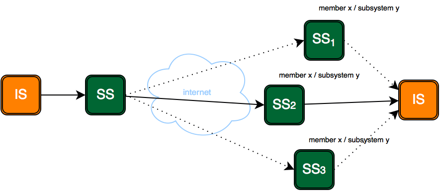

layout: true
name: sininen-palkki
class: sininen-palkki

---
layout: true
name: header
class: center, middle, sininen

---
layout: true
name: valkoinen
class: valkoinen

<!--DON'T TOUCH ABOVE THIS !!!!!! -->
---

template: header

# Kuormantasaus

---

template: sininen-palkki

# Agenda:
* Mitä haetaan?
   * Korkea saatavuus (HA) ✓
   * Suorituskyky

Aiheena palvelun*tarjoajan* kuormantasaus

✓ = saatavilla tällä hetkellä
---

template: sininen-palkki

# Kaksi tapaa
## Sisäinen kuormantasaus
* Saatavilla
* Kutsuja tietää, että käyttää useaa liityntäpalvelinta

## Ulkoinen kuormantasaus
* Tulossa Q2/2017 (pilottikäyttö alkamassa lähiaikoina)
* Kutsuja kuvittelee käyttävänsä yhtä liityntäpalvelinta

---

template: sininen-palkki

# Sisäänrakennettu HA-tuki

* X-Roadissa on sisäänrakennettuna yksinkertainen korkean saatavuuden mekanismi
* Jos sama palvelu* on rekisteröity usealle liityntäpalvelimelle, käytetään sitä liityntäpalvelinta joka vastaa nopeiten

(*) Sama palvelu = sama organisaatio & alijärjestelmä & palvelu

.center[]
---

template: sininen-palkki

# Sisäänrakennettu HA-tuki

* Jos tämä liityntäpalvelin lakkaa vastaamasta pyyntöihin, aletaan kutsua seuraavaksi nopeimmin vastaavaa
* Ratkaisu siis auttaa saavuttamaan korkean saatavuuden (HA)

.center[]

---

template: sininen-palkki

# Sisäänrakennettu HA-tuki: ongelma

* Jos tällaiseen klusteriin kuuluu liityntäpalvelimet SS1, SS2, SS3, jokin niistä on
yleensä nopein vastaamaan pyyntöihin ("lyhyimmät piuhat")
* Yksi klusterin nodeista vastaa kaikkiin pyyntöihin, toiset laiskottelevat
* Ei ole juuri hyödyksi suorituskyvyn suhteen

---

template: sininen-palkki

# Sisäänrakennettu HA-tuki: muutoksia
* Versiossa 6.7.13 parannettiin toimintaa luotettavammaksi (verkko)virhetilanteissa
* Versiossa 6.9 parannetaan yhteysavausten nopeutta ja luotettavuutta, nopeutetaan toipumista verkko-ongelmista, ja parannetaan konfiguroitavuutta
* H2/2017 tulossa parannuksia, joilla mahdollisesti saadaan sisäänrakennettu HA myös jakamaan kuormaa tehokkaammin

---

template: sininen-palkki

# Ulkoinen kuormantasaus
# Toimintaperiaate

---

template: sininen-palkki

# Toimintaperiaate
* Klusteriin kuuluu n kappaletta nodeja
* Kaikki palvelevat aktiivisesti asiakkaita (ei hot standby)
* Ulkomaailma näkee nämä yhtenä nodena
* Yksi node on konfiguraation suhteen master, muut slaveja
* Väylässä on siis virallisesti yksi liityntäpalvelin, ja epäviralliset slave nodet teeskentelevät olevansa se

---

template: sininen-palkki

# Tekninen toteutus
* Konfiguraatiotietokanta on klusteroitu
  * PostgreSQL streaming replication (hot standby)
* Konfiguraatiotiedostot kopioidaan masterilta slaveille
  * Rsync+ssh
  * Ajastetusti
* Slaveilla
  * On read-only käyttäjä
  * Tai ei ole ollenkaan käyttöliittymää
* Healthcheck
* XRoad-sovellukseen on tehty muutoksia jotka mahdollistavat klusteroinnin

---

template: sininen-palkki

# Ulkoisen klusteroinnin käyttöönotto
* Asennus
   * Ansible
   * Asennus käsin https://github.com/vrk-kpa/X-Road/blob/PVAYLADEV-698-feature-load-balancer-install-instructions/doc/Manuals/LoadBalancing/ig-xlb_x-road_external_load_balancer_installation_guide.md
* Varsinainen kuormanjakaja (ELB, F5, nginx...) out of scope
* Konfigurointi tehdään master nodelle
* Konfiguraatiomuutokset päivittyvät master -> slavet viiveellä
   * -> klusteri hetken epäkonsistentti
