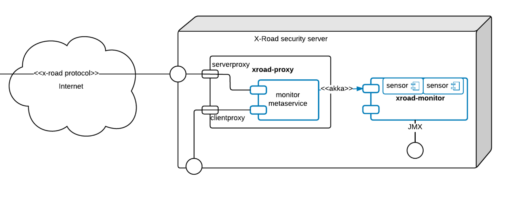
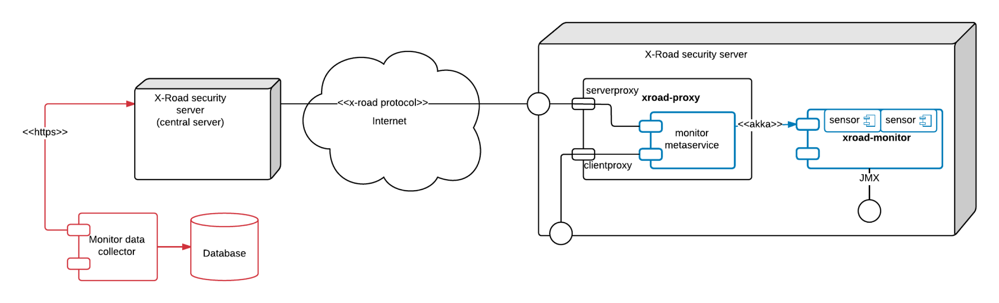
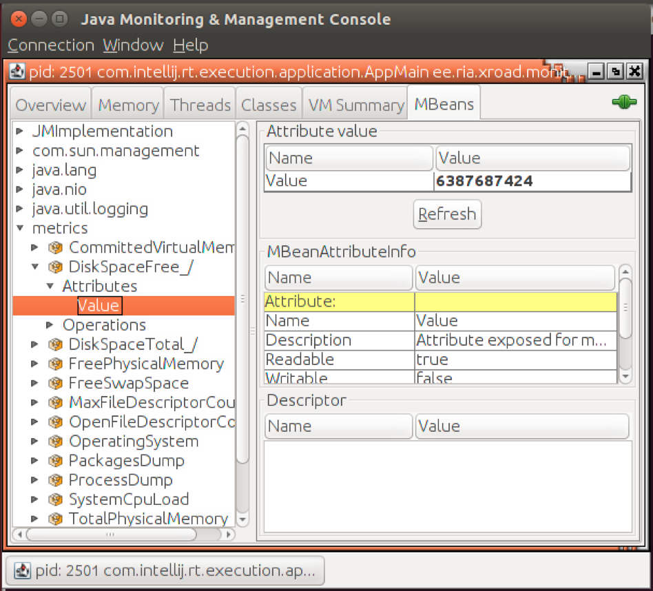

layout: true
name: sininen-palkki
class: sininen-palkki


---
layout: true
name: valkoinen
class: valkoinen


---
layout: true
name: header
class: center, middle, sininen


<!--DON'T TOUCH ABOVE THIS !!!!!! -->
---

template: header
# Monitorointi

---

template: sininen-palkki

# Liityntäpalvelimen valvontaominaisuudet

- Ympäristön valvonta
   - Environmental monitoring
   - Muistin määrä, levytila, OS, ohjelmistoversiot…
- Toiminnan valvonta (ei vielä käytössä)
   - Operational monitoring
   - Välitettyjen kutsujen lukumäärä, onnistuneet / epäonnistuneet palvelukutsut, keskimääräinen suoritusaika...

---

template: sininen-palkki

# Ympäristön valvonta: miksi?

- Isoveli valvoo ja auttaa
   - Pakolliset päivitykset asennettu?
   - Tuki ongelmatilanteissa
- Oman palveluväylä-kokoonpanon valvonta
- Tilastot käytetyistä muiden tarjoamista palveluista
   - SLA

---

template: sininen-palkki

# Ympäristön valvonta – liityntäpalvelimen toteutus



---

template: sininen-palkki

# Ympäristön valvonta – keskitetty valvonta



---

template: sininen-palkki

# Ympäristön valvonta, sensorit

- Asennetut paketit
- Ajossa olevat prosessit
- Käyttöjärjestelmä
- Vapaan levytilan määrä
- Muistin määrä (yhteensä / vapaa)
- CPU-kuorma
- Avoimien tiedostokahvojen määrä

---

template: sininen-palkki

# Ympäristön valvonta, käyttö

- Metapalvelu getSecurityServerMetrics
- Eli normaali X-Road SOAP sanoma
- Poikkeuksena elementti server, jota käytetään normaalien client ja service headerien lisäksi

---

template: valkoinen

```xml
<SOAP-ENV:Envelope xmlns:SOAP-ENV="http://schemas.xmlsoap.org/soap/envelope/" xmlns:id="http://x-road.eu/xsd/identifiers" xmlns:m="http://x-road.eu/xsd/monitoring" xmlns:xrd="http://x-road.eu/xsd/xroad.xsd">
 <SOAP-ENV:Header>
    ...
 </SOAP-ENV:Header>
 <SOAP-ENV:Body>
    <m:getSecurityServerMetricsResponse>
       <m:metricSet>
          <m:name>SERVER:DEMO/DMO/DEMO-SS1/SS1</m:name>
          <m:stringMetric>
             <m:name>proxyVersion</m:name>
             <m:value>6.9.3-1.20170323093433git84490ea</m:value>
          </m:stringMetric>
          <m:metricSet>
             <m:name>systemMetrics</m:name>
             <m:histogramMetric>
                <m:name>CommittedVirtualMemory</m:name>
                <m:updated>2017-03-31T11:52:32.785Z</m:updated>
                <m:min>2806009856</m:min>
                <m:max>2806009856</m:max>
                <m:mean>2806009856</m:mean>
                <m:median>2806009856</m:median>
                <m:stddev>0.0</m:stddev>
             </m:histogramMetric>
             ...
```

---

template: sininen-palkki
class: split-55

# Ympäristön valvonta, käyttö

.column[
- Vaihtoehtoisesti JMX:n avulla
- Kuvassa JConsole
- Zabbix, Nagios…
]

.column[]

---

template: sininen-palkki

# Ympäristön valvonta, käyttöoikeudet

- Liityntäpalvelimen omistaja (organisaatio) saa tiedot
- Keskusvalvoja saa tiedot
- Muut eivät, eikä lupaa voi antaa

---

template: sininen-palkki

# Toiminnan valvonta

- Käytössä Virossa
- Tullut 6.9 versiossa
- Suomessa ei vielä aktivoitu toimintakuntoon
- Paketti xroad-opmonitor ja saman niminen service
- Kerää paikalliseen tietovarastoon statistiikkaa palvelukutsuista ja tarjoaa sitä tietoa ulos
   - Esim. keskimääräinen suoritusaika
- Kuten ympäristön valvonta, toimii joko JMX:llä tai X-Road SOAP palvelukutsuilla

---
template: header
# Kysymyksiä?
