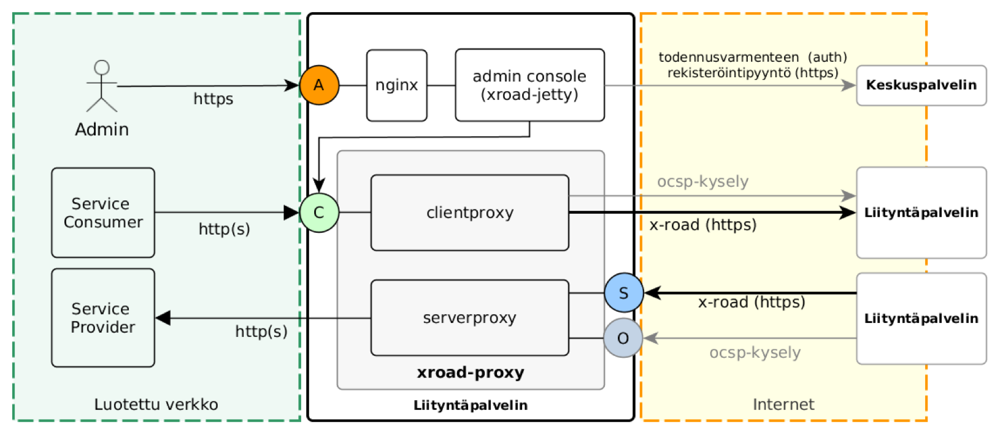
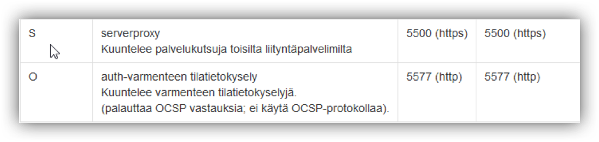
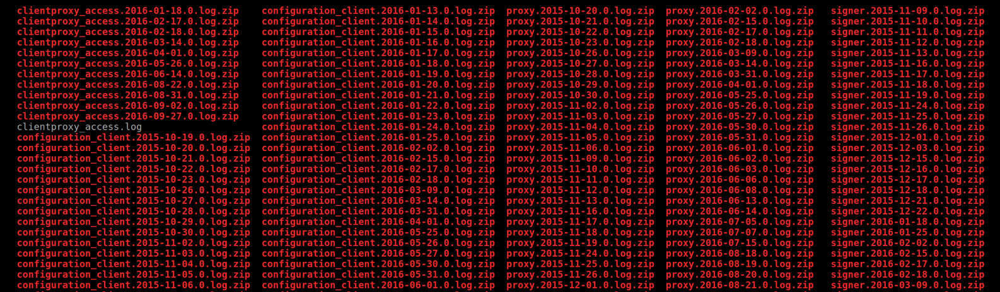

layout: true
name: sininen-palkki
class: sininen-palkki


---
layout: true
name: valkoinen
class: valkoinen


---
layout: true
name: header
class: center, middle, sininen


<!--DON'T TOUCH ABOVE THIS !!!!!! -->
---

template: header
# Prosessit, tekstilokit ja portit

---

template: sininen-palkki

# Liityntäpalvelimen prosessit
|Palvelu             |Tarkoitus                        |Loki                                       |
|:-------------------|:--------------------------------|:------------------------------------------|
|xroad-confclient    |Keskuskonfiguraation hakeminen   | `/var/log/xroad/configuration_client.log` |
|xroad-jetty (Ubuntu)<br>xroad-jetty9 (RHEL)|Käyttöliittymä |`/var/log/xroad/jetty/jetty.log`      |
|xroad-proxy         |Viestinvälitys                   |`/var/log/xroad/proxy.log`                 |
|xroad-signer        |Avainten ja varmenteiden hallinta|`/var/log/xroad/signer.log`                |
|nginx               |Edustapalvelin                   |`/var/log/nginx/`                          |
|postgresql          |Tietokantapalvelin               |`/var/log/postgresql/`                     |

---

template: sininen-palkki

# Liityntäpalvelimen portit

--

--


---

template: sininen-palkki

# Tekstilokit
* Liityntäpalvelimen prosessien lokit kirjoitetaan oletuksena `/var/log/xroad/` hakemiston alle
* Lokeja kertyy yksi per päivä (100MB kokoraja)
* Lokeja ei poisteta automaattisesti



---

template: sininen-palkki

# Tesktilokit

* Lokeihin kirjoitettavaa dataa voidaan säätää eritasoiseksi
   * `ERROR`, `WARN`, `INFO` (oletuksena), `DEBUG`, `OFF`
* Ei ole tehty selvitystä kuinka paljon käytännössä vaikutusta tallennuskapasiteetin käyttöön
* Lokitason muuttaminen hakemistossa /`etc/xroad/conf.d logback.xml`-tiedostoille tai `local.ini`-tiedostoon (= pysyvä vaihtoehto, joka ei ylikirjoitu softan päivittyessä)
   * Esim. proxy-logback.xml:
   ```xml
      <logger name="ee.ria.xroad" level="INFO" />
            <root level="INFO">
               <appender-ref ref="FILE" />
            </root>
   ```

---

template: header
# Kysyttävää?
