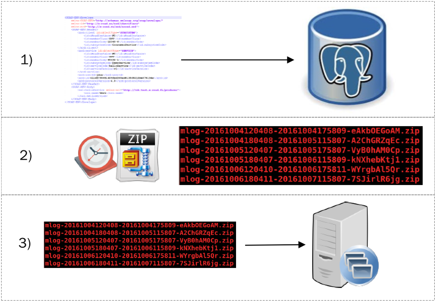

layout: true
name: sininen-palkki
class: sininen-palkki


---
layout: true
name: valkoinen
class: valkoinen


---
layout: true
name: header
class: center, middle, sininen


<!--DON'T TOUCH ABOVE THIS !!!!!! -->
---

template: header
# Sanomalokien hallinta

---

template: sininen-palkki
class: split-40

# Sanomien lokitus

.column[
1. Sanomien otsikkotiedot, tiivisteet ja allekirjoitukset tallentuvat paikalliseen PostgreSQL-tietokantaan
   * SOAP body-osa oletuksena pois päältä
2. Kannan viestit arkistoidaan zip-tiedostoon (var/lib/xroad) tietyin väliajoin
3. Zip-tiedostoja kertyy levylle ajan mittaan ja ne tulee siirtää tai poistaa
]
.column[]

---

template: sininen-palkki

#  Liityntäpalvelimen levytila

* Liityntäpalvelimella levytilaa tarvitsevat pääasiassa:
   * Tekstilokit (`var/log/xroad`, ei siivota automaattisesti)
   * Tietokanta (`messagelog` -taulu, automaattisesti siivotaan oletuksena yli 30 päivää vanhat)
   * Arkistoidut sanomalokit (`/var/lib/xroad`, ei siivota automaattisesti)
   * SOAP-viestin liitetiedostot (sanoma käsittelyn ajan)
* Liityntäpalvelimen tarvitseman levytilan arviointi: [esuomi.fi liityntäpalvelimen tekniset vaatimukset](https://esuomi.fi/palveluntarjoajille/palveluvayla/tekninen-aineisto/hyva-tietaa/liityntapalvelimen-tekniset-vaatimukset/
)

---

template: sininen-palkki

# Sanomalokit

* Oletusparametrit sanomalokeihin liittyen löytyy täältä: /etc/xroad/conf.d/addon/message-log.ini
* Kaikki omat muokkaukset tehtävä /conf.d/local.ini –tiedostoon, jotta softan päivitys ei ylikirjoita muutoksia
* Luo sinne [message-log] –otsikko, jonka alle omat muutokset parametreihin. Lopuksi xroad-proxy pitää uudelleen käynnistää.

```yml
   [message-log]
   archive-path=/my/archive/path
   archive-max-filesize=67108864
```

---

template: sininen-palkki

# Konfiguroitavia parametreja

* Sanomalokiin liittyy monia parametreja, joiden käyttö kuvataan dokumentissa [X-Road System parameters ](https://github.com/ria-ee/X-Road/blob/develop/doc/Manuals/ug-syspar_x-road_v6_system_parameters.md)
* Alla muutama esimerkki

|Parametri           |Oletusarvo          |Selite                             |
|:-------------------|:-------------------|:----------------------------------|
|archive-interval    |0 0 0/6 1/1 * ? *   |CRON lauseke, joka määrittää kuinka usein aikaleimattuja viestejä arkistoidaan|
|archive-path        |/var/lib/xroad      |Polku, mihin arkistoidut tiedostot tallennetaan|
|keep-records-for    |30                  |Montako päivää aikaleimattuja ja arkistoituja sanomia pidetään tietokannassa|

---

template: sininen-palkki

# Arkistoitujen sanomalokien siirto

* Esimerkki Ubuntulta siirrettäessä voidaan käyttää rsync-tiedonsiirtoa.
   * Luodaan skripti arkistoitujen sanomalokien siirtoon
   ```bash
      #!/bin/bash
      rsync --remove-source-files -a --include='*.zip' --exclude='*' /var/lib/xroad/ \
      kayttajatunnus@kohdearkistonosoite.com:/polku/arkistointi/kansioon
   ```
* Lisätään skripti liityntäpalvelimen ajettavaksi aina arkistotiedostoa muodostettaessa asettamalla viestilokin parametri local.ini-tiedostoon

   ```yml
      [message-log]
      archive-transfer-command=/usr/share/xroad/scripts/archive-rsync-transporter.sh

   ```
---

template: header
# Kysymyksiä?
