layout: true
name: sininen-palkki
class: sininen-palkki


---
layout: true
name: valkoinen
class: valkoinen


---
layout: true
name: header
class: center, middle, sininen


<!--DON'T TOUCH ABOVE THIS !!!!!! -->
---

template: header
# Toiminnan testaus

---

template: header

# Admin-käyttöliittymä

---

template: sininen-palkki

# Admin-käyttöliittymä

- Liityntäpalvelin näyttää admin-käyttöliittymässä viestejä virhetilanteissa
- Yleisimmät virheviestit ovat
   - Global configuration is expired: keskuskonfiguraation hakemisessa on jokin ongelma
   - Please enter softtoken PIN: oikeaa PIN-koodia ei ole syötetty, avaimia ei voi käyttää
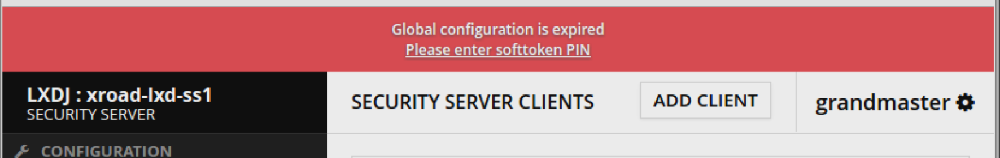

---

template: sininen-palkki
class: split-40

# Diagnostiikka

.column[
- Vihreä = OK
- Keltainen = Odottaa testausta
- Punainen = Vika
- Testit
   - Keskuskonfiguraation haku
   - Yhteys aikaleimapalvelimelle
   - Yhteys OCSP-responderiin
]

.column[
   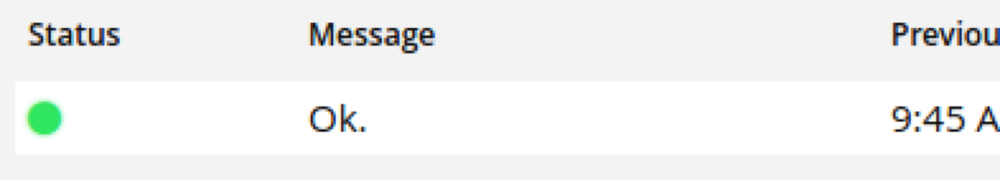
   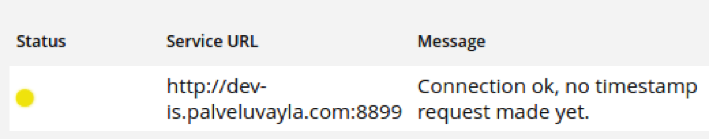
   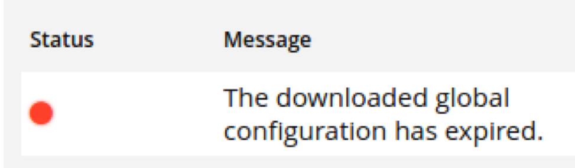
]

---

template: sininen-palkki

# Esimerkkejä

1.  Palvelin on juuri käynnistetty
   - PIN-koodia ei ole syötetty
   - Keskuspalvelin ei ole saatavilla, keskuskonfiguraatioita ei voida hakea
   - Yhtään viestiä ei olla välitetty (eikä aikaleimattu)
2. Keskuspalvelin ja keskuskonfiguraatio ovat kunnossa
   - Viestejä ei olla välitetty (eikä aikaleimattu)
3. Viestejä on välitetty ja aikaleimattu

---

template: sininen-palkki

# Esimerkki 1
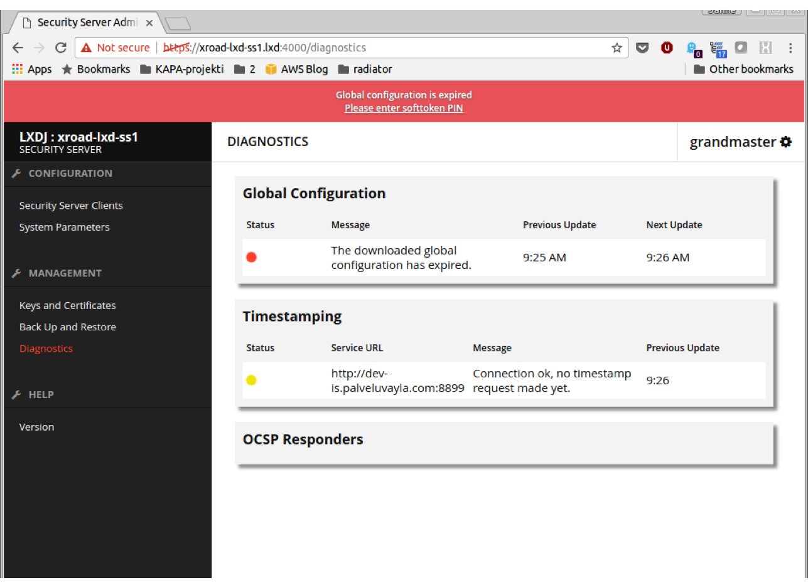

---

template: sininen-palkki

# Esimerkki 2
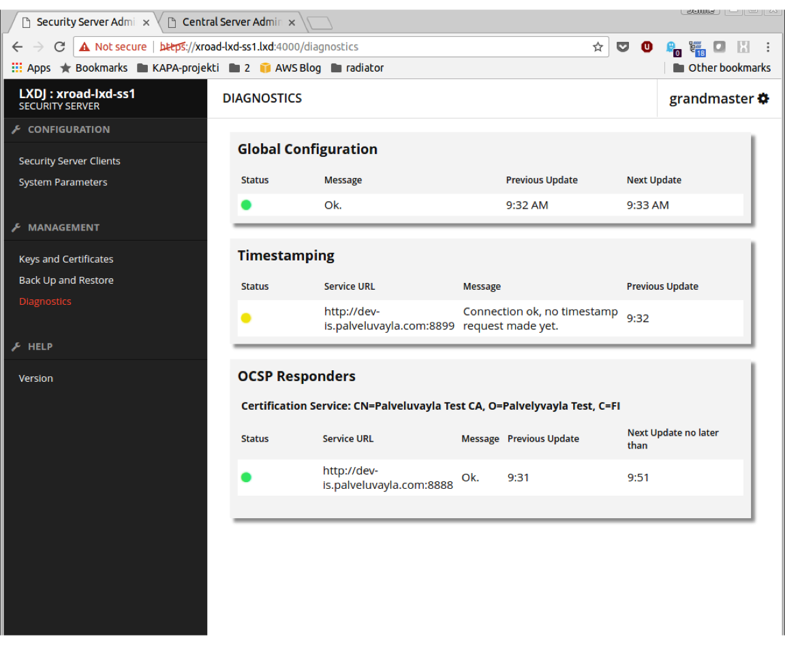

---

template: sininen-palkki

# Esimerkki 3
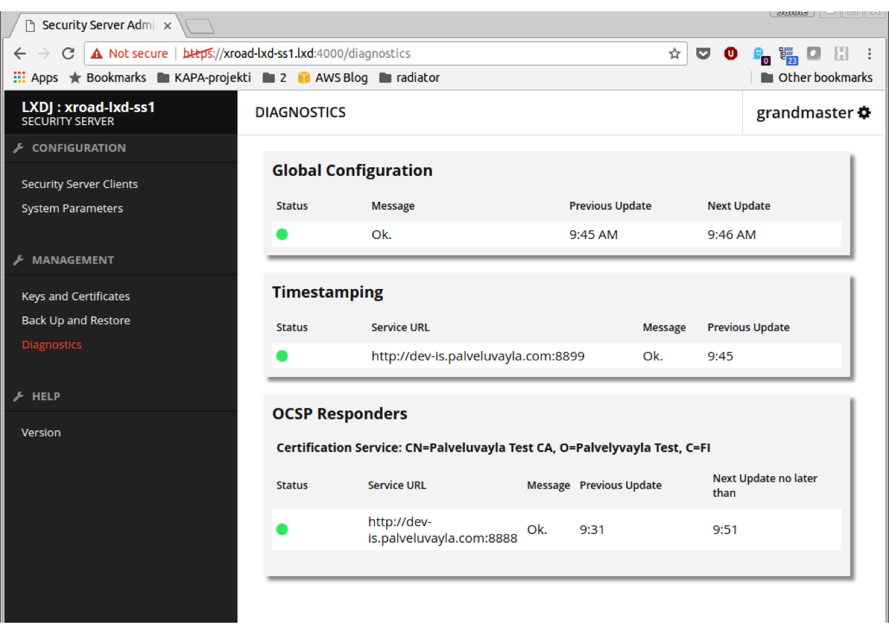

---

template: sininen-palkki

# Clients-näkymä

- Clientin rekisteröinnin tila näkyy värikoodattuna pallona
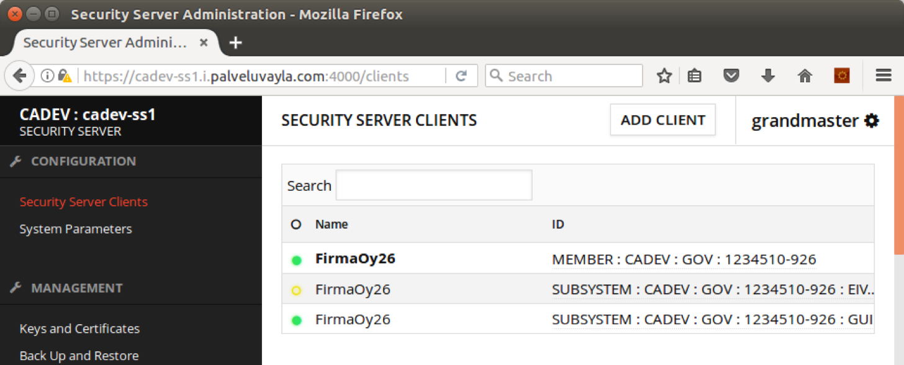

---

template: sininen-palkki
class: clientList

# Clients-näkymän värikoodaus

- Clientin rekisteröinnin tila näkyy värikoodattuna pallona
   -  Saved
   -  Registration in progress
   -  Registered
   -  Global error
      - Poistettu keskuspalvelimelta, mutta ei paikallisesti
   -  Deletion in progress
      - Poistopyyntö lähetetty liityntäpalvelimelta

---

template: sininen-palkki

# Keys and certificates

- Tietoa varmenteista
- OCSP response
   - Unknown
   - Good
   - Revoked
   - Expired
   - Suspended
   - Disabled
- Expires
   - Voimassaoloaika
- Status
   - Registered / Registration in progress / Deleted...

---

template: sininen-palkki

# Esimerkki: Varmenteet kunnossa

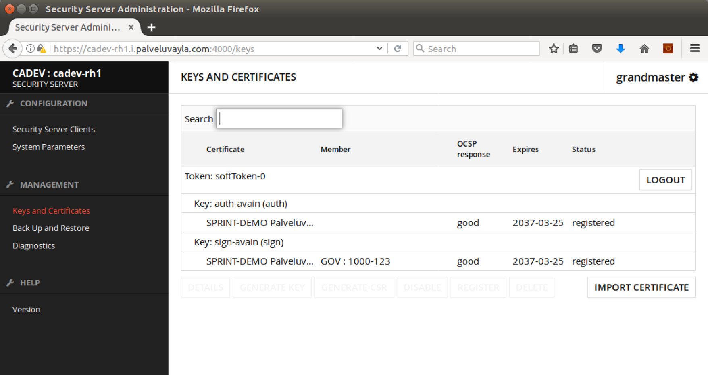

---

template: sininen-palkki

# Esimerkki: Ei yhteyttä OCSP-responderiin

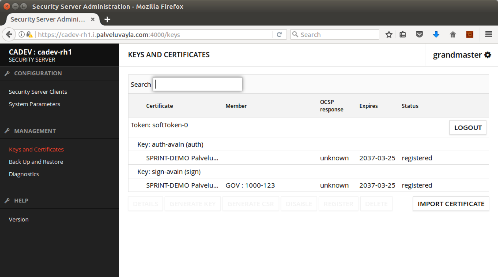

---

template: sininen-palkki

# Esimerkki: Varmenteet revokoitu

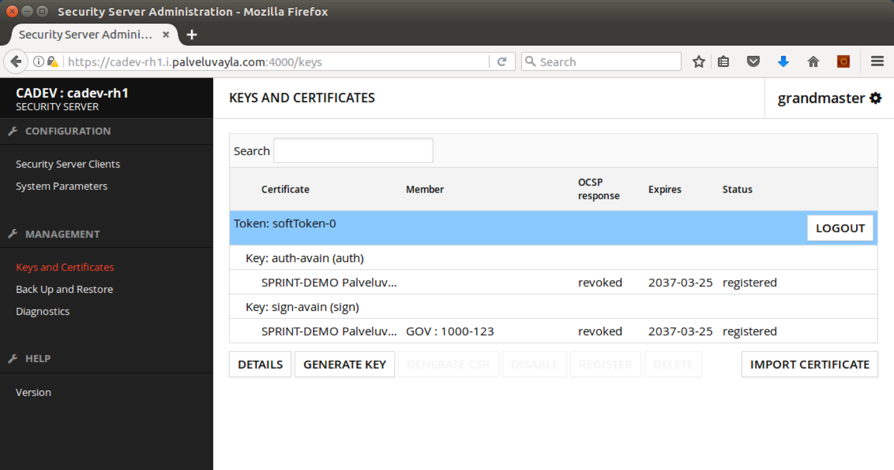

---

template: header

# Viestinvälityksen testaaminen

---

template: sininen-palkki

# Metapalvelut 1

- Kaikissa liityntäpalvelimissa on sisäänrakennettuna muutamia ns. metapalveluja, joita voidaan käyttää myös toimintakunnon testaamiseen
- Metapalveluita voi kutsua kuka tahansa, niitä ei luviteta erikseen
- Kaikilla liityntäpalvelimilla on yhteys keskuspalvelimen liityntäpalvelimeen → esimerkiksi sen metapalvelua voidaan kutsua kun halutaan testata toimivatko tietoliikenneyhteydet
- Älä kuitenkaan kuormita keskusliityntäpalvelimia turhaan! Ei sovellu jatkuvaan automaattiseen valvontaan

---

template: sininen-palkki

# Metapalvelut 2

- listClients
- listCentralServices
- *listMethods*
   - Listaus tietyn organisaation tarjoamista palveluista
   - Normaali X-Road SOAP protokollakutsu
   - Kutsu välitetään organisaation liityntäpalvelimelle
   - Sopii hyvin viestinvälityksen toimivuuden testaamiseen!
- listAllowedMethods
- wsdl

---

template: sininen-palkki

# listMethodsin testaaminen

- Voit testata viestinvälitystä keskuspalvelimen liityntäpalvelimelle (satunnaisesti)
- Keskuspalvelimen liityntäpalvelimen koordinaatit löytyvät esimerkiksi
- /etc/xroad/globalconf/&#60;instance id&#62;/private-params.xml -tiedostosta

```xml
<managementRequestServiceProviderId ns2:objectType="SUBSYSTEM">
      <ns2:xRoadInstance>CADEV</ns2:xRoadInstance>
      <ns2:memberClass>GOV</ns2:memberClass>
      <ns2:memberCode>1234510-926</ns2:memberCode>
      <ns2:subsystemCode>GUITEST26</ns2:subsystemCode>
</managementRequestServiceProviderId>
```

---

template: valkoinen

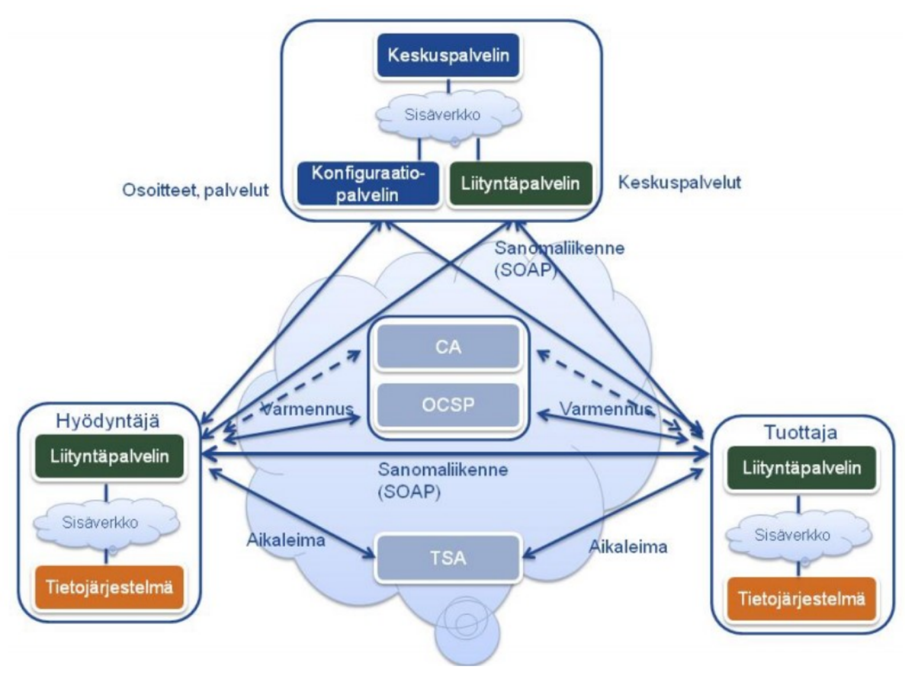

---

template: valkoinen

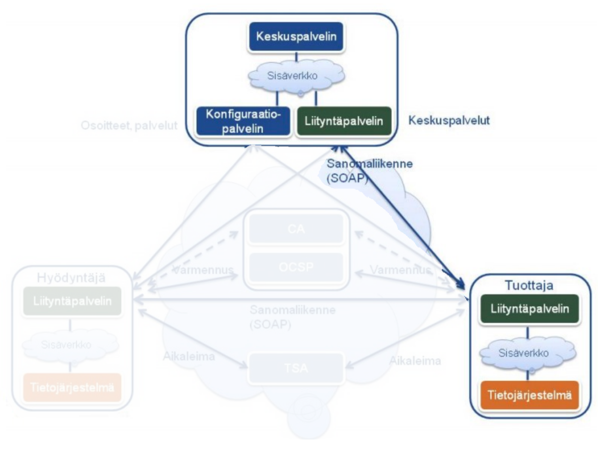

---

template: sininen-palkki

# listMethodsin testaaminen

- ListMethods-kutsun voit lähettää esimerkiksi curl -komennolla omalta liityntäpalvelimeltasi

```bash
$ curl --header "content-type: text/xml" http://localhost -d @request.xml
```

---

template: valkoinen
class: smaller-code-font

Vastaus curl -komentoon:
```xml
<soapenv:Envelope xmlns:soapenv="http://schemas.xmlsoap.org/soap/envelope/" xmlns:iden="http://x-road.eu/xsd/identifiers" xmlns:xro="http://x-road.eu/xsd/xroad.xsd" xmlns:xro1="http://xroad.vrk.fi/xroad-catalog-lister">
   <soapenv:Header>
      <xro:protocolVersion>4.x</xro:protocolVersion>
      <xro:id>dummy-ID11234</xro:id>
      <xro:requestHash algorithmId="http://www.w3.org/2001/04/xmlenc#sha512">8lSx+Q4c8QpT6n4OgtN1EvxVYWOjHckHjBTq3N5qhIaZGCaSyq/JVo7wIUoWzabp7Ea1h+zRYY7iUcNC3uN49A==</xro:requestHash>
      <xro:userId>dummy-EE1234567890</xro:userId>
      <xro:client iden:objectType="SUBSYSTEM">
         <iden:xRoadInstance>CADEV</iden:xRoadInstance>
         <iden:memberClass>GOV</iden:memberClass>
         <iden:memberCode>2077-1</iden:memberCode>
         <iden:subsystemCode>SS2077</iden:subsystemCode>
      </xro:client>
      <xro:service iden:objectType="SERVICE">
         <iden:xRoadInstance>CADEV</iden:xRoadInstance>
         <iden:memberClass>GOV</iden:memberClass>
         <iden:memberCode>1234510-926</iden:memberCode>
         <iden:subsystemCode>GUITEST26</iden:subsystemCode>
         <iden:serviceCode>listMethods</iden:serviceCode>
      </xro:service>
   </soapenv:Header>
   <soapenv:Body>
      <xro:listMethodsResponse>
         <xro:service iden:objectType="SERVICE">
            <iden:xRoadInstance>CADEV</iden:xRoadInstance>
            <iden:memberClass>GOV</iden:memberClass>
         ...
```

---

template: valkoinen
class: smaller-code-font

Request.xml -file
```xml
<soapenv:Envelope
        xmlns:soapenv="http://schemas.xmlsoap.org/soap/envelope/"
        xmlns:xro="http://x-road.eu/xsd/xroad.xsd"
        xmlns:iden="http://x-road.eu/xsd/identifiers"
        xmlns:xrcl="http://xroad.vrk.fi/xroad-catalog-collector">
    <soapenv:Header>
        <xro:protocolVersion>4.x</xro:protocolVersion>
        <xro:id>dummy-ID11234</xro:id>
        <xro:userId>dummy-EE1234567890</xro:userId>
        <xro:client iden:objectType="SUBSYSTEM">
            <iden:xRoadInstance>CADEV</iden:xRoadInstance>
            <iden:memberClass>GOV</iden:memberClass>
            <iden:memberCode>2077-1</iden:memberCode>
            <iden:subsystemCode>SS2077</iden:subsystemCode>
        </xro:client>
        <xro:service iden:objectType="SERVICE">
            <iden:xRoadInstance>CADEV</iden:xRoadInstance>
            <iden:memberClass>GOV</iden:memberClass>
            <iden:memberCode>1234510-926</iden:memberCode>
            <iden:subsystemCode>GUITEST26</iden:subsystemCode>
            <iden:serviceCode>listMethods</iden:serviceCode>
        </xro:service>
    </soapenv:Header>
    <soapenv:Body>
        <listMethods/>
    </soapenv:Body>
</soapenv:Envelope>
```

---

template: sininen-palkki

# Viestinvälityksen testaaminen

- Luonnollisesti myös oikeita palveluita voi käyttää testaamiseen metapalvelujen sijaan
- Myös liityntäpalvelimen omia palveluja voi kutsua (client = server)

---

template: sininen-palkki

# Kuormantasauksen healthcheck

- Tulossa Q2/2017
- Healthcheck palauttaa HTTP 200 OK viestin kun liityntäpalvelin on toimintakuntoinen, ja HTTP 500 mikäli ei

```bash
$ curl -i localhost:5588
HTTP/1.1 500 Server Error
Transfer-Encoding: chunked
Server: Jetty(8.y.z-SNAPSHOT)

Fetching health check response timed out for: Authentication key OCSP status
```

---

template: sininen-palkki

# Aiemmin käsiteltyä toiminnan testausta

- Prosessit käynnissä?
- Portit kuuntelevat?
- Tekstilokeihin tulostuu tavaraa
- Tekstilokeissa ei “epänormaaleja” virheilmoituksia
- Valvonta

---
template: header
# Kysymyksiä?
