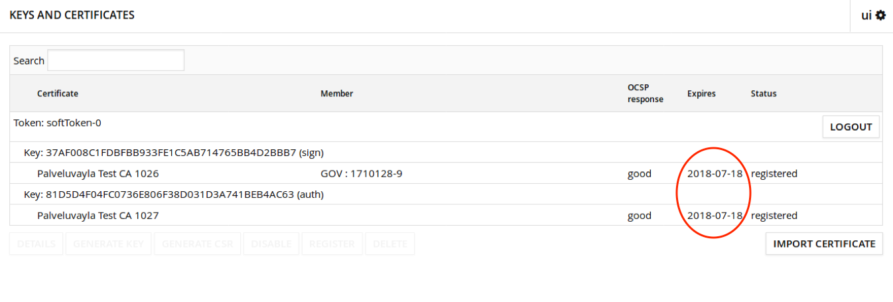
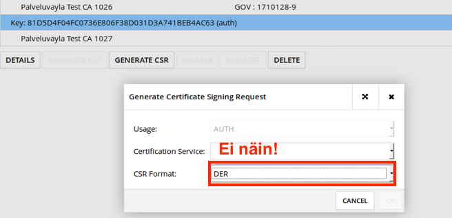
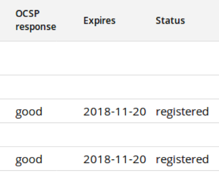
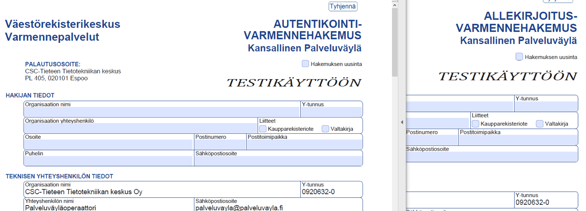
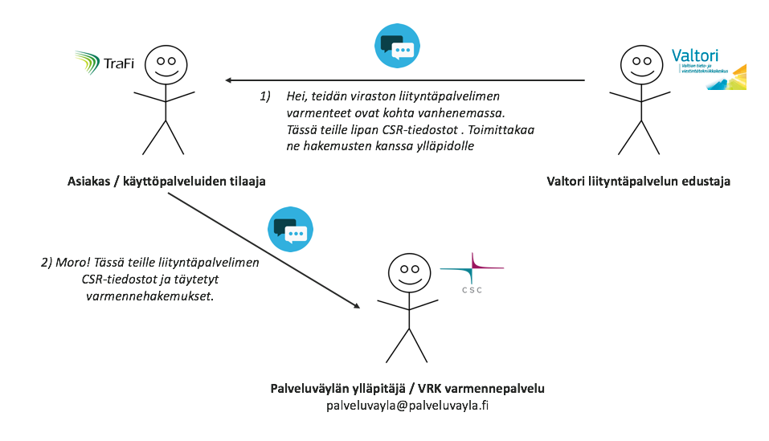
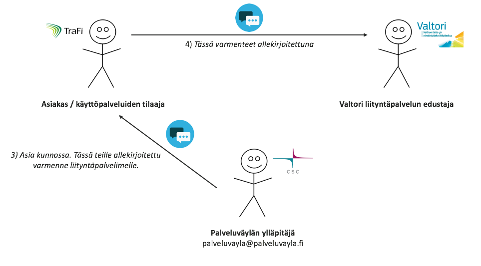

layout: true
name: sininen-palkki
class: sininen-palkki

---
layout: true
name: valkoinen
class: valkoinen

---
layout: true
name: header
class: center, middle, sininen

<!--DON'T TOUCH ABOVE THIS !!!!!! -->
---

template: header
# Varmenteiden uusiminen

---

template: sininen-palkki

# Varmenteiden vanheneminen

- Varmenteet ovat voimassa 2 vuotta (testi- ja tuotantoympäristö)
   - Kehitysympäristössä?
   - Pro tip: Kalenteriin merkintä lähestyvästä expires-päivämäärästä, jotta ne ehditään uusia ja näin vältytään käyttökatkolta

---

template: sininen-palkki

# Varmenteiden uusiminen (1/2)

- Luodaan luoduille palvelin- ja allekirjoitusavaimille uudet CSR:ät – muuten edetään samaan tyyliin kuin normaalissa CSR:n luomisessa
   - Suosikaa PEM formaattia CSRissä (VRK Varmennepalvelun toive)
   - Lähetetään ylläpidolle allekirjoitettavaksi: palveluvayla@palveluvayla.fi

---

template: sininen-palkki
class: split-70

# Varmenteiden uusiminen (2/2)

.column[
- TÄRKEÄÄ! Antakaa uusien varmenteiden olla rinnakkain aktiivisina vanhenemassa olevien varmenteiden kanssa ainakin vuorokauden ajan
   - Status pitäisi olla registered ja OCSP response good
   - Tieto uudesta varmenteesta ehtii leviämään palveluväyläympäristön sisällä
- Sen jälkeen vanhenevat varmenteet voi disabloida ja poistaa
]

.column[]

---

template: sininen-palkki

# Uusien varmenteiden hankkimen

- Testi- ja tuotantoympäristössä organisaation täytettävä uusittavat hakemukset eSuomen sivuilta
   - Lähitulevaisuudessa Suomi.fi-palveluiden palveluhallintasivuilta: https://palveluhallinta.suomi.fi/fi

---

template: sininen-palkki

# Varmenteiden hallinta FI-TEST- ja FI-ympäristöissä (osa 1)

---

template: sininen-palkki

# Varmenteiden hallinta FI-TEST- ja FI-ympäristöissä (osa 2)

---

template: sininen-palkki

# Miksi asiakaan tarvitsee toimia välikätenä?

- Varmenteiden tilaamiseen tarvitaan toimija, jolla on organisaation nimenkirjoitusoikeus
- Mikäli varmenteita tilaa henkilö, jolla ei ole organisaation nimenkirjoitusoikeutta, tulee olla valtakirja. Valtakirjaksi riittää yleensä yksinkertainen
   - ”Valtuutamme Nano Nano Organisaation X edustajana hakemaan palvelinvarmenteita Väestörekisterikeskukselta organisaatio.fi – verkkotunnukselle.” (+Allekirjoittajana organisaation nimenkirjoitusoikeuden haltija)

---
template: header
# Kysymyksiä?
