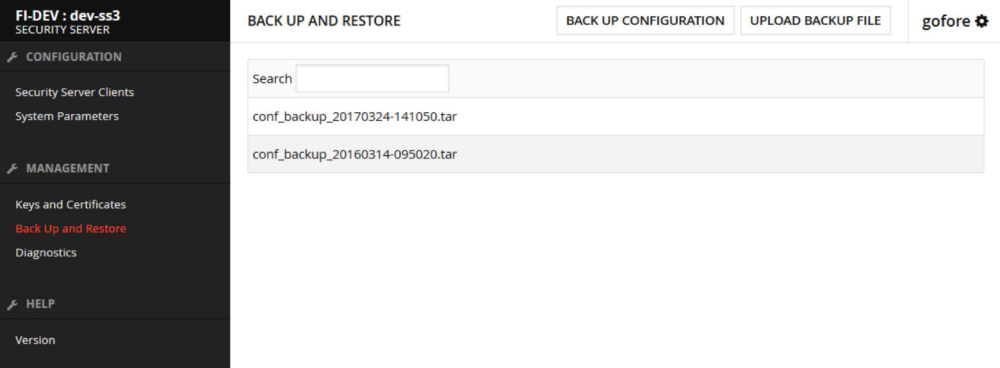

layout: true
name: sininen-palkki
class: sininen-palkki


---
layout: true
name: valkoinen
class: valkoinen


---
layout: true
name: header
class: center, middle, sininen


<!--DON'T TOUCH ABOVE THIS !!!!!! -->
---

template: header
# Varmuuskopiointi

---

template: sininen-palkki

# Varmuuskopiointi ja palauttaminen

- Varmuuskopion tekeminen ja palauttaminen onnistuu liityntäpalvelimen käyttöliittymästä.




---

template: sininen-palkki

# Varmuuskopiointi

- Tallentaa kaikki /etc/xroad hakemiston konfiguraatiot.
   - Myös avaimet ja varmenteet
- Oletuskansio mihin backupit tallennetaan /var/lib/xroad/backup
- Suositeltava tehtäväksi esimerkiksi
   - Ennen päivitysten asennuksia
   - Yleensä omien konfiguraatioiden jälkeen

---

template: sininen-palkki

# Varmuuskopiointi komentoriviltä

- Ajetaan xroad-käyttäjänä
- Backup kannattaa tehdä oletuskansioon niin se näkyy myös käyttöliittymässä

```bash
$ /usr/share/xroad/scripts/backup_xroad_proxy_confugiration.sh -s AA/GOV/TS1=WNER/TS1 -f /var/lib/xroad/backup/mybackup.tar
```

---

template: sininen-palkki

# Palauttaminen komentoriviltä

- Ajetaan xroad-käyttäjänä
   -  Konfiguraation palauttaminen
   ```bash
   $ /usr/share/xroad/scripts/restore_xroad_proxy_configuration.sh -s <security server ID> -f <path + filename>
   ```
   - Esimerkiksi
   ```bash
   $ /usr/share/xroad/scripts/restore_xroad_proxy_configuration.sh -s AA/GOV/TS1OWNER/TS1 \
   -f /var/lib/xroad/backup/conf_backup_20140703-110438.tar
   ```
   - Konfiguraation palauttaminen toiselle liityntäpalvelimelle kuin alkuperäinen -F vivulla
   ```bash
   $ /usr/share/xroad/scripts/restore_xroad_proxy_configuration.sh -F \
   -f /var/lib/xroad/backup/conf_backup_20140703-110438.tar
   ```

---
template: header
# Kysymyksiä?
