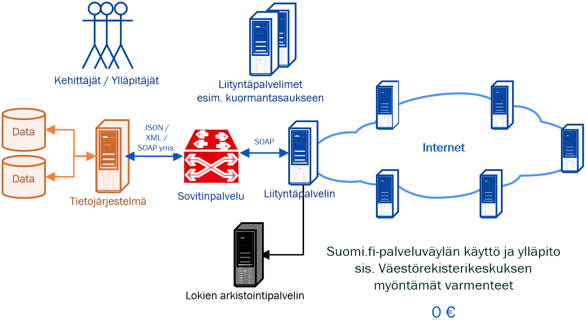

layout: true
name: sininen-palkki
class: sininen-palkki

---
layout: true
name: valkoinen
class: valkoinen

---
layout: true
name: header
class: center, middle, sininen

<!--DON'T TOUCH ABOVE THIS !!!!!! -->
---

template: header
# Suomi.fi-palveluväylän yleisesittely (TODO)

---

template: sininen-palkki

# Suomi.fi-palveluväylä

- Tiedonvälityskokonaisuus, joka toimii viestiväylänä siihen liitettyjen palveluiden ja tietovarantojen välillä
- Käyttövelvollisuus koskee julkista-, käyttöoikeus yksityistä sektoria. 
- Palveluväylän kautta tarjottavat tiedot joko sopimuksenvaraisia hyödyntäjän ja tarjoajan välillä, tai vapaasti kaikkien liittyneiden käytettävissä. 
   
---

template: sininen-palkki

# Suomi.fi-palveluväylä

- Perustuu Viron X-Road ratkaisuun
- Kehitystyö jatkuu tiiviissä yhteistyössä virolaisten kanssa
- Tarjoaa keskitetyt palvelut sanomaliikenteen mahdollistamiseksi liityntäpalvelimien välillä
    - Osoitteiden hallinta ja reititys
    - Käyttöoikeuksien hallinta
    - Salaus 
    - Aikaleimat
    - Lokitus
    - Federointi Viron ympäristöön (tällä hetkellä FI-DEV ja FI-TEST)
    - Tuki asennusvaiheessa sekä ongelmatilanteissa
- Toimittajana Väestörekisterikeskus. ympäristöjen hallinnointi tapahtuu yhdessä CSC:n kanssa
Suomi.fi-palveluväylän kehitys- ja ylläpito siirtyy VRK:lle lakisääteiseksi tehtäväksi 

---

template: sininen-palkki

# Liityntäkatalogi

- https://liityntakatalogi.suomi.fi/
- Hakemisto Suomi.fi-palveluväylän (FI-ympäristön) tarjottavista palveluista ja lista liittyneistä organisaatioista
- Tarkoituksena on helpottaa eri palveluntarjoajien palveluväyläympäristöön lisättyjen palveluiden löytämistä 
- Liittynyt organisaatio täyttää puuttuvat tiedot, kun palvelu on saatu tuotua tuotantoympäristöön.

---

template: sininen-palkki

# Liityntäkatalogi 

- https://liityntakatalogi.suomi.fi/ 
    - Hallinnolliset kuvaukset
    - Tekniset rajapintakuvaukset 

---

template: sininen-palkki

# Liittymisprosessi kuvana 

- https://esuomi.fi/palveluntarjoajille/palveluvayla/liittyminen/
- Tuotantoympäristöön liittyminen edellyttää testiympäristöön liittymistä 
- Oman järjestelmän integraatiotyön suunnittelu ja toteutus kannattaa myös aloittaa
- Liityntäpalvelimen asennukseen testi- tai tuotantoympäristöön voi kulua jopa kuukausi
    - Varmennepalvelun ruuhkat aiheuttavat viivettä 
- Kehitysympäristöön liittyminen suhteessa kevyempää, sillä sinne ei tarvita varmennehakemuksia
    - Hyvä vaihtoehto, jos ei esimerkiksi tuotantoon siirtyminen ole näkypiirissä

---

template: sininen-palkki

# Mikä maksaa käyttöönotossa?

---
template: sininen-palkki

# Yhteystiedot

- kapa-asiakaspalvelu@vrk.fi 
    - Auttaa yleisissä hallinnollisissa asioissa
      - Auttaa etsimään vastaavat henkilöt mistä tahansa Suomi.fi-palvelusta
    - esim. KaPa-lain velvoittavuuskysymykset
    
- palveluvayla@palveluvayla.fi 
    - Palveluväyläympäristöjen ylläpitäjät
    - Yhteyspiste liityntäpalvelin asennuksen ja konfiguroinnin aikana 
        - Yhteydenpitoa tarvitaan mm. rekisteröintien ja varmennekäsittelyjen aikana 
        
---
template: header

# Kysymyksiä?
