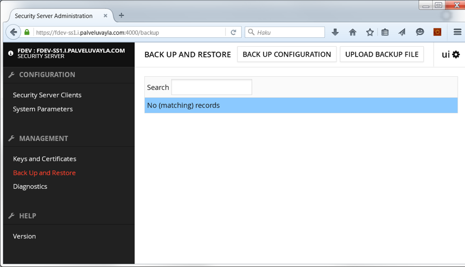

class: middle, center

# Liityntäpalvelimen admin-toimintoja

---
# Sisältö

* Backup / Restore
* Diagnostiikka
* Levytilan vapauttaminen
* Palomuurit, portit
* Valvonta, prosessit
* PIN-koodi syöttäminen
* Konfiguraatioparameterit

---
# Backup/Restore

* Tallentaa liityntäpalvelimen konfiguraattion, myös avaimet ja varmenteet

---
